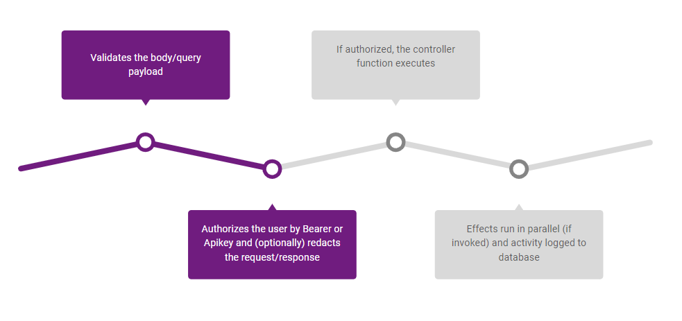

# Composer

The composer package ships a highly opinionated approach to declaring express routes. It uses prototypal inheritance to declare specific middleware ahead and behind the primary controller (see execution order below). 

</img>

## `Controller.validation`

Validation always executes first. It thinly wraps the express-validator library, so the API should seem familiar. The chief difference is that sanitization happens automatically: it will return an error with bad data or strip extraneous data before continuing.

``` Javascript

const { compose, check } = require('q3-core-composer');

const Controller = async (req, res) => res.ok();

Controller.validation = [
  check('firstName').isString(),
  check('lastName').isString(),
];

module.exports = compose(Controller);

```