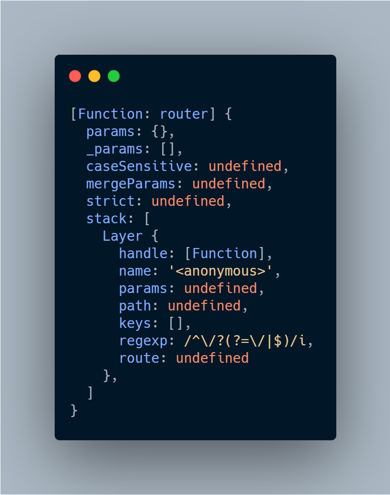

# Puncher

Sometimes, middleware exported by plugins needs modifying in the receiving application. Natively, express does not allow for route overwriting, so we created a small function for replacing specific route handlers in the stack. 

If you were to log what a router instance looks like, you'll see the following:

</img>

The `puncher` module follows the stack, looking for a match on two different properties: `path` and `method`. If detected, it will swap handlers. Note that you must use `puncher` __before__ registering plugins with Q3.

``` Javascript
const { middleware } = require('q3-api-plugin-foo');
const puncher = require('q3-core-puncher');

const handle = (req, res) => res.ok();

puncher(middleware, {
  path: '/foo',
  method: 'post',
  handle,
});
```